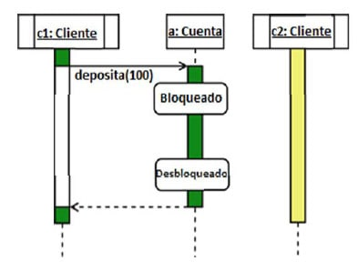
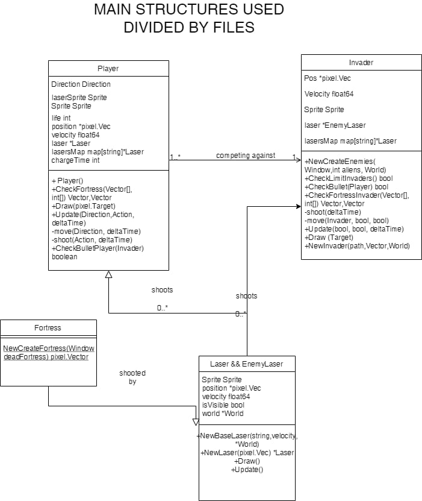
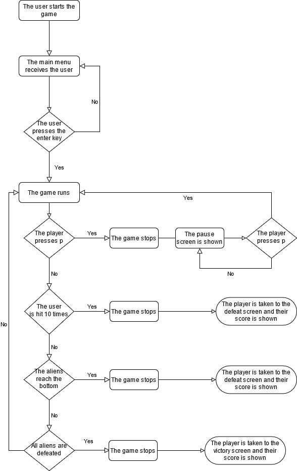
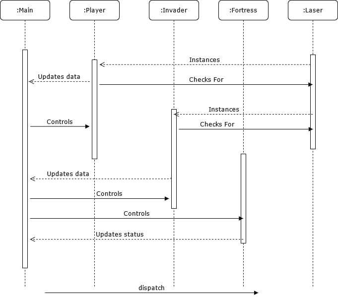

# Architecture

## General structure
We divided the program in modules
to make it easier to understand it, we divided the main components into different files and we put them into a lib folder. The most important files are the Fortress, Invaders, Player, and the Lasers.
## Concurrency

## Project's structure

## User experience flow chart

## Sequential diagram

