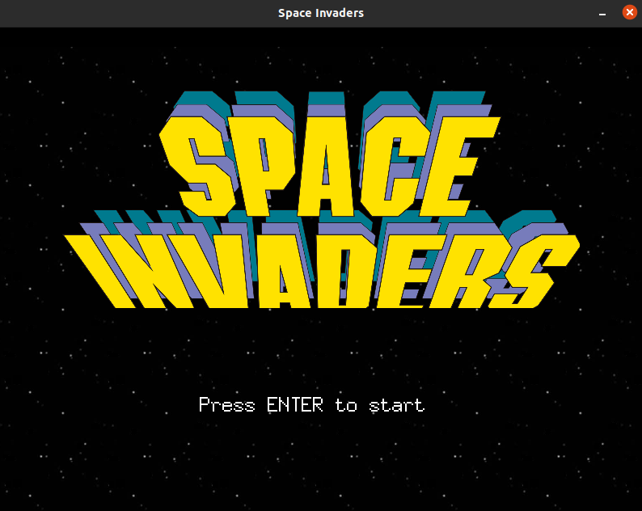

# Space Invaders instructions to run the project

### Requisites before running the project
- Download and install the following packages
    1. sudo apt install -y libgl1-mesa-dev
    2. sudo apt install -y xorg-dev

### Build and automation
1. Instructions to build and run project
    - Run the command "make test" in the terminal
    - Dependencies are downloaded and installed automatically when running the command above

### Dependencies used to create the project
1. github.com/faiface/pixel
2. github.com/faiface/pixel/imdraw
3. github.com/faiface/pixel/pixelgl
4. golang.org/x/image/colornames
5. github.com/oklog/ulid/v2

### Manual installation of dependencies
1. go get github.com/faiface/pixel
2. go get github.com/faiface/pixel/imdraw
3. go get github.com/faiface/pixel/pixelgl
4. go get golang.org/x/image/colornames
5. go get github.com/oklog/ulid/v2